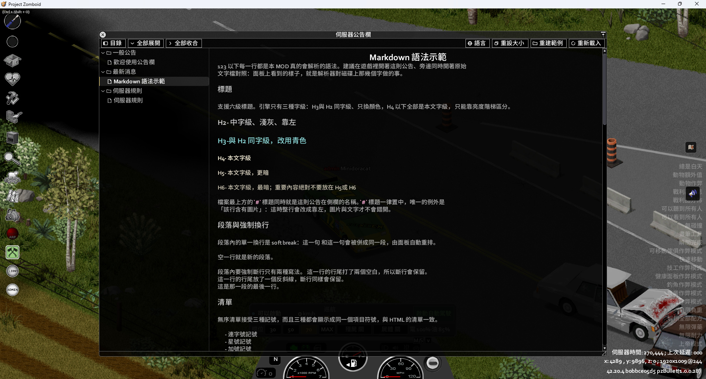
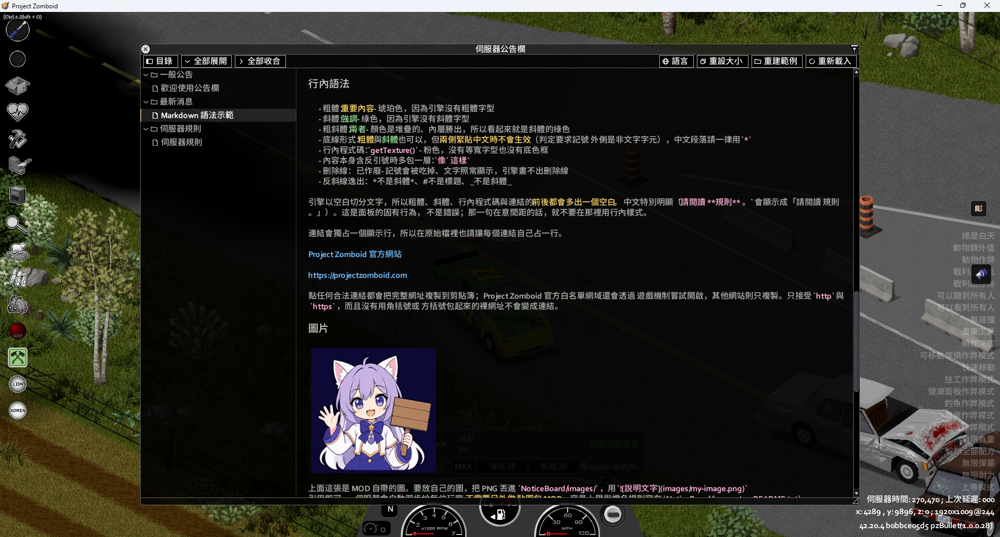
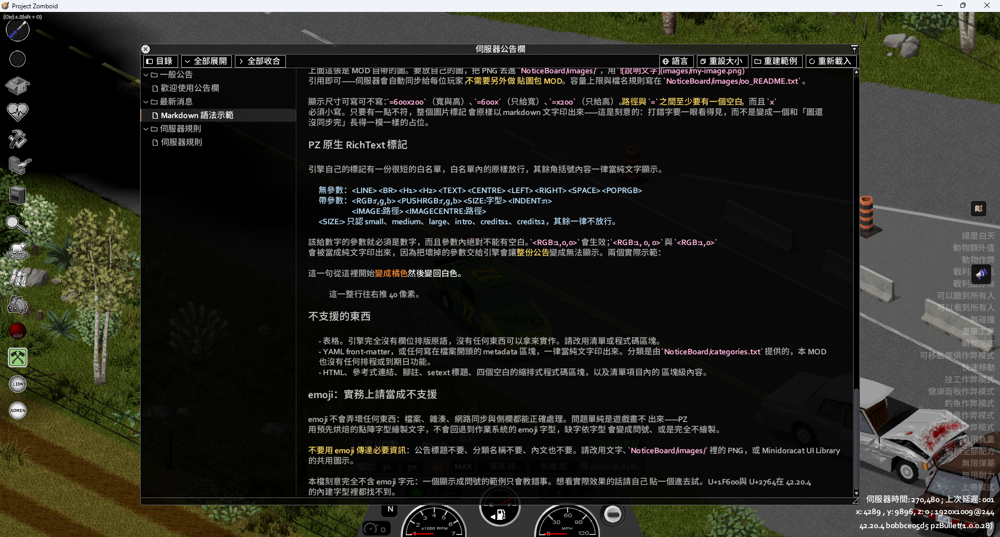
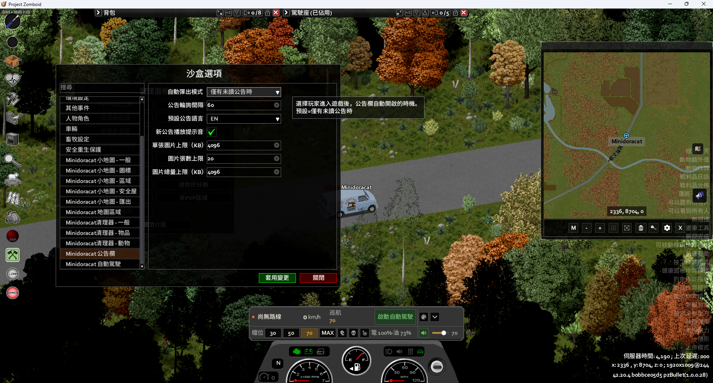
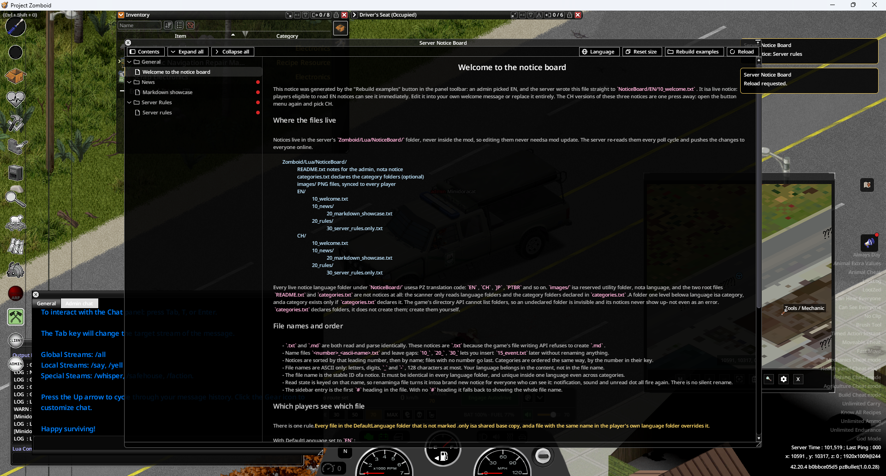
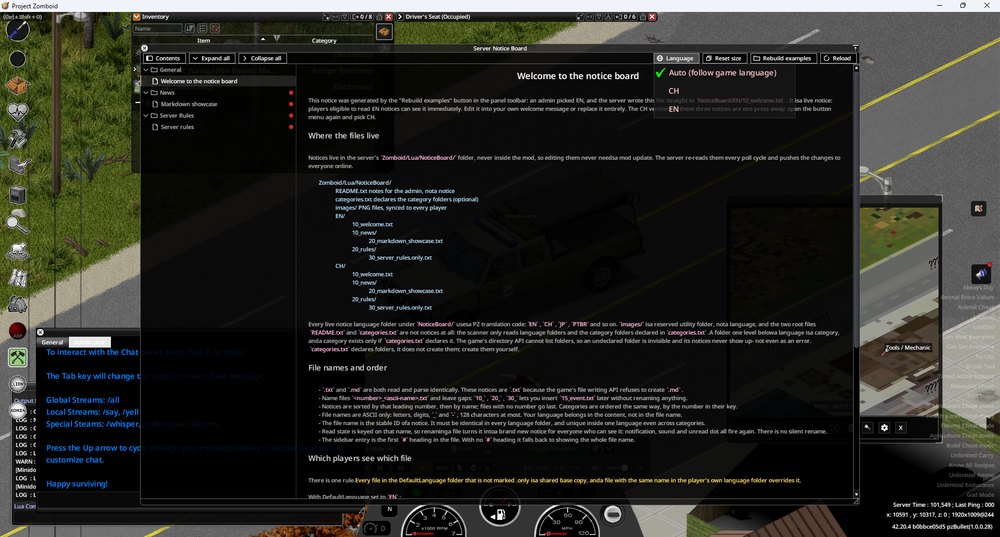
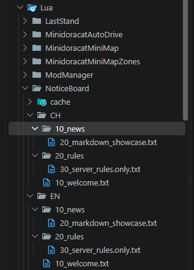
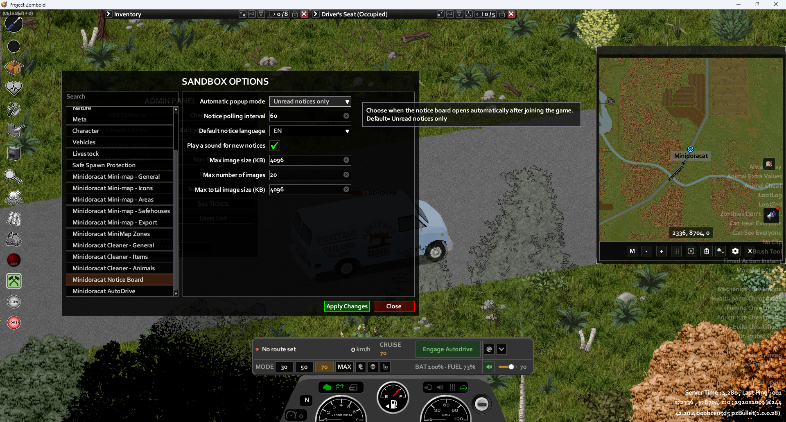

# Minidoracat Notice Board for B42

遊戲內公告欄，直接編輯 Markdown 檔案即可更新（依伺服器輪詢間隔生效），多份檔案以可收合文件樹瀏覽，並支援自訂分類與多語公告；玩家可跟隨遊戲語系或自行切換伺服器提供的語系

Project Zomboid Build 42 MOD。

## 截圖

### 繁體中文

| | |
|---|---|
|  |  |
|  |  |

### English

| | |
|---|---|
|  |  |
|  |  |

Steam Workshop 用 JPG（≤280KB，Steamworks 預覽圖上傳上限）在 `docs/screenshots/steam/{zh,en}/`，編號與上表一致；`publish_workshop.py --mode screenshots` 會依英文→中文、檔名順序同步到作品頁。

## 功能

- **Markdown 公告**：公告內容以 Markdown 撰寫，遊戲內自動排版顯示
- **浮動圖標位置**：拖曳放開後立即保存，每種解析度各自記憶；重生與重新進入遊戲時還原，位置還原不會強制開啟已隱藏的圖標
- **近即時更新**：編輯公告檔案存檔後，遊戲內於伺服器輪詢間隔（`PollIntervalSeconds`，預設 60 秒；管理員可按面板「重新載入」立即刷新）內反映，不需重啟伺服器
- **多檔文件樹與自訂分類**：每份 `.md`/`.txt` 都是獨立公告（每語系上限 200 檔）；服主可用 `NoticeBoard/categories.txt` 宣告多語分類並把檔案放進對應目錄，玩家從側欄快速切換。側欄預設就是展開的，分類與公告各有圖示（缺前置 MOD 的圖示資產時自動退回文字記號，功能不受影響）。側欄工具列提供「全部展開」與「全部收合」按鈕，一鍵操作所有分類，不必逐個點擊；展開時若玩家曾明確收合側欄，會一併打開側欄；窄視窗強制收合仍優先保護內文寬度
- **自訂公告語系**：服主可用 PZ 支援的語系代碼建立 `NoticeBoard/<LANG>/`，想提供幾種就放幾種；有 `.md`/`.txt` 公告內容的語系會自動出現在工具列選單，玩家可選「自動（跟隨遊戲語系）」或手動切換
- **公告語音與試聽**：面板的「語音」圖示按鈕可切換中文、英文、日文或跟隨遊戲語系，與公告文字語系分開記憶；旁邊的音量滑桿顯示百分比，放開滑桿或選擇語音時立即試聽。預設保留原提示音，音量與「選項 → MODS」共用，既有靜音設定同樣適用
- **公告可放圖片，自動同步給玩家**：把 PNG 放進伺服器的 `NoticeBoard/images/`，在公告裡用 Markdown 圖片語法引用即可；伺服器分批推送到玩家本機快取，**不需要另外做圖包 MOD、玩家也不必額外訂閱**。放新檔名的圖或原地覆蓋同名檔案都會自動偵測（比對檔案大小），下一輪輪詢生效
- **圖片尺寸與容量可控**：支援 `` 指定顯示尺寸（`=600x`／`=x200` 依原圖比例補另一邊）；張數（`MaxImageCount`）、單張大小（`MaxImageKB`）、總量（`MaxImageTotalKB`）皆為沙盒選項。玩家端快取以連線的伺服器位址分命名空間、總量 128 MB 上限、最久未使用者優先在背景淘汰，同步中斷會從缺的分塊接續而非整張重傳
- **一鍵重建範例公告（管理員限定）**：按面板上的「重建範例」並選 CH 或 EN，伺服器會把所選語系三則示範公告連同根層 `README.txt`、`categories.txt` 直接寫進正式公告目錄並立即刷新；符合語系可見規則的玩家不必等下一輪輪詢。每次固定覆寫這 5 個路徑，另一語系、其他公告與 `images/` 不動不刪。根層 `categories.txt` 會改成範例分類，選單已明示警告，按前請先備份

## 安裝

- Steam Workshop：https://steamcommunity.com/sharedfiles/filedetails/?id=3789836823
- **必要前置 MOD**：[Minidoracat UI Library for B42](https://steamcommunity.com/sharedfiles/filedetails/?id=3789836701)（`require=MinidoracatUIFor42`；未訂閱時本 MOD 不會載入）
- 手動安裝：把 `MOD/MinidoracatNoticeBoardFor42/Contents/mods/MinidoracatNoticeBoardFor42` 複製到 `%USERPROFILE%\Zomboid\mods\` 並將資料夾改名為 `MinidoracatNoticeBoardFor42`

## 開發

- `link_workshop.bat`：手動同步、狀態檢查與歸檔卸載（實體副本）
- `PZ_Test.bat`：啟動前自動同步 MOD 與家族依賴；Steam／no-Steam／Debug／多開皆保留。資料邊界見 `../pz-family-docs/tools.md`

## 版本

版本號格式：`{PZ 版本}-{mod 版本}`（例 `42.20.2-0.1.0`），詳見 [CHANGELOG.md](CHANGELOG.md)。

## 授權

本專案採 [MIT License](LICENSE)（Copyright (c) 2026 Minidoracat），涵蓋作者持有權利的全部內容：`MOD/**/media/lua/` 下的 Lua、`scripts/` 下的 Python／PowerShell／Lua 測試、`docs/` 說明文件、翻譯 JSON、`mod.info`／`workshop.txt`／`sandbox-options.txt` 等設定檔，以及自製的封面、介面素材與音訊（`preview.png`、`42/poster.png`、`workshop/preview.gif`、`media/ui/NoticeBoard/*.png`、`media/sound/MinidoracatNBNotify.wav`、`media/sound/MinidoracatNBVoice{CH,EN,JP}.wav`）。

提示音與中／英／日語音由作者確認使用自己的帳號生成並提供；作者就其持有的權利，一併以 MIT 授權。

下列素材含第三方權利，不在 MIT 授權範圍內：

- `docs/screenshots/**`：Project Zomboid 實際遊戲畫面截圖，畫面內容權利屬 The Indie Stone，僅作為本 MOD 的說明用途。

程式碼註解與文件中的 `*.java:行號` 是對 Project Zomboid 引擎行為的出處標註，本倉庫不含任何反編譯原始碼。

## 作者

Minidoracat — [Discord](https://discord.gg/Gur2V67) | [Twitch](https://www.twitch.tv/minidoracat)

### 發布到 Workshop

雙擊 `Publish_Workshop.bat`：先確認 Steam 用戶端已以作者帳號登入（未登入會喚起 Steam 並等你登入後重試），
再選擇更新 MOD 內容（含 `STEAM_CHANGELOG.md` 更新說明）／GIF 封面／簡介／全部；提交後回查 Steam，
任一不符即以非零碼結束。設定在 `scripts/workshop_publish.json`（Workshop ID、簡介語言槽來源、GIF 路徑）。

```
uv run --no-project python -B scripts/publish_workshop.py --mode all --yes       # 自動化／AI；或 content / preview / description
uv run --no-project python -B scripts/publish_workshop.py --mode all --dry-run   # 只檢查、顯示計畫
```

退出碼：`0` 成功／`2` 參數或取消／`3` 未登入、帳號不是擁有者／`4` 前置檢查失敗／`5` 提交失敗／`6` 已提交但回查不符。
網頁動態封面放 `MOD/<資料夾>/workshop/preview.gif`（不在 `Contents/`，不會下載給玩家）；遊戲內上傳器仍用 `preview.png`，
且每次會把網頁封面覆回靜態，需要動態封面時一律改用本工具發布。
